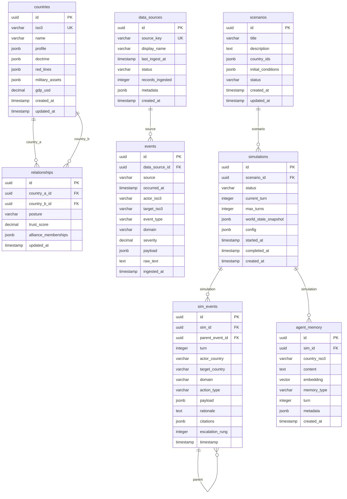

# Swarm — Architecture Reference

## 1. ER Diagram



---

## 2. Entity Definitions

### `countries`
Master registry of country agents. Each entry carries static reference data plus doctrine fields used to seed the LLM system prompt.

| Column | Type | Notes |
|---|---|---|
| `id` | UUID PK | `gen_random_uuid()` |
| `iso3` | VARCHAR(3) UNIQUE NOT NULL | ISO-3166 alpha-3 |
| `name` | VARCHAR NOT NULL | Display name |
| `profile` | JSONB | GDP, population, military strength, etc. |
| `doctrine` | JSONB | Decision-making posture, risk tolerance |
| `red_lines` | JSONB | Explicit conditions that trigger escalation |
| `military_assets` | JSONB | Ships, missiles, cyber units, etc. |
| `gdp_usd` | NUMERIC | Latest GDP in USD for quick sorting |
| `created_at` | TIMESTAMPTZ | |
| `updated_at` | TIMESTAMPTZ | |

---

### `relationships`
Bilateral relationship state between any two countries. Used by agents during the `perceive` step to assess allies, adversaries, and neutral parties.

| Column | Type | Notes |
|---|---|---|
| `id` | UUID PK | |
| `country_a_id` | UUID FK → countries | |
| `country_b_id` | UUID FK → countries | |
| `posture` | ENUM(`allied`, `friendly`, `neutral`, `tense`, `hostile`) | |
| `trust_score` | INTEGER (-100 to 100) | Canonical range is −100..100 int, matching the sim engine WorldState. DB column is informational; runtime uses in-memory WorldState. |
| `alliance_memberships` | JSONB | `["NATO", "QUAD"]` |
| `updated_at` | TIMESTAMPTZ | |

UNIQUE(`country_a_id`, `country_b_id`).

---

### `events`
Raw normalized events ingested from data sources. This is the read layer for the data lake — one row per event regardless of origin. The agent RAG pipeline reads from here.

| Column | Type | Notes |
|---|---|---|
| `id` | UUID PK | |
| `data_source_id` | UUID FK → data_sources | lineage |
| `source` | VARCHAR NOT NULL | `"gdelt"`, `"acled"`, etc. |
| `occurred_at` | TIMESTAMPTZ NOT NULL | Event time (not ingest time) |
| `actor_iso3` | VARCHAR(3) | May be null for non-state actors |
| `target_iso3` | VARCHAR(3) | May be null |
| `event_type` | VARCHAR | Source-specific code |
| `domain` | VARCHAR | `diplomatic`, `economic`, `cyber`, `kinetic_limited`, `kinetic_general`, `info` |
| `severity` | NUMERIC | Normalized 0–10 |
| `payload` | JSONB | Full source record |
| `raw_text` | TEXT | Headline or description |
| `ingested_at` | TIMESTAMPTZ | |

Index: `(source, occurred_at)` for time-windowed queries by source.
GIN index on `payload` for JSONB containment queries.

---

### `data_sources`
Registry of every ingestion source run — provides lineage and health monitoring.

| Column | Type | Notes |
|---|---|---|
| `id` | UUID PK | |
| `source_key` | VARCHAR UNIQUE | `"gdelt"`, `"acled"` |
| `display_name` | VARCHAR | Human label |
| `last_ingest_at` | TIMESTAMPTZ | |
| `status` | ENUM(`active`, `degraded`, `disabled`) | |
| `records_ingested` | INTEGER | Cumulative |
| `metadata` | JSONB | Rate limits, auth notes, endpoint |
| `created_at` | TIMESTAMPTZ | |

---

### `scenarios`
A "what-if" prompt authored by the user. A scenario is the input specification; a simulation is the execution of a scenario.

| Column | Type | Notes |
|---|---|---|
| `id` | UUID PK | |
| `title` | VARCHAR NOT NULL | |
| `description` | TEXT | Free-form user prompt |
| `country_ids` | JSONB | `["CHN","TWN","USA",...]` |
| `initial_conditions` | JSONB | Posture overrides, initial events |
| `status` | ENUM(`draft`, `ready`, `archived`) | |
| `created_at` | TIMESTAMPTZ | |
| `updated_at` | TIMESTAMPTZ | |

---

### `simulations`
A single execution run of a scenario. One scenario may be run many times.

| Column | Type | Notes |
|---|---|---|
| `id` | UUID PK | |
| `scenario_id` | UUID FK → scenarios | |
| `status` | ENUM(`pending`, `running`, `paused`, `completed`, `aborted`, `error`) | |
| `current_turn` | INTEGER | 0-indexed |
| `max_turns` | INTEGER | Default 20 |
| `world_state_snapshot` | JSONB | Serialized world at completion |
| `config` | JSONB | Model overrides, random seed |
| `started_at` | TIMESTAMPTZ | |
| `completed_at` | TIMESTAMPTZ | |
| `created_at` | TIMESTAMPTZ | |

---

### `sim_events`
The crown-jewel event type — every discrete action taken by a country agent in a simulation turn. These are what stream over the WebSocket to the frontend to drive globe animations.

See **Section 5 — SimEvent Schema** for the full field-by-field breakdown.

---

### `agent_memory`
Per-country episodic memory store for RAG. Each row is one memory fragment (a past action, a perceived threat, a piece of intelligence) with a 1536-dimensional embedding for semantic retrieval.

**Embedding model:** `voyage-3` (Voyage AI) — 1536 dimensions, optimized for factual/domain content, superior recall on geopolitical text compared to `text-embedding-3-small`. Pinned at 1536 dims throughout; do not change without re-indexing.

| Column | Type | Notes |
|---|---|---|
| `id` | UUID PK | |
| `sim_id` | UUID FK → simulations | |
| `country_iso3` | VARCHAR(3) | Owning agent |
| `content` | TEXT | The memory fragment text |
| `embedding` | vector(1536) | Voyage-3 embedding |
| `memory_type` | ENUM(`observation`, `decision`, `intel`, `doctrine`) | |
| `turn` | INTEGER | Turn when memory was formed |
| `metadata` | JSONB | Arbitrary extra context |
| `created_at` | TIMESTAMPTZ | |

Index: HNSW on `embedding` (`vector_cosine_ops`, m=16, ef_construction=64).

---

## 3. REST API Specification (OpenAPI 3.1 style)

Base URL: `http://localhost:8000` (dev) / `https://api.swarm.example.com` (prod)

All responses follow:
```json
{
  "data": { ... },
  "error": null
}
```
or on error:
```json
{
  "data": null,
  "error": {
    "code": "VALIDATION_ERROR",
    "message": "Human-readable string",
    "details": [{ "field": "scenario_id", "issue": "must be a valid UUID" }]
  }
}
```

---

### `GET /api/countries`

List all countries in the registry.

**Query parameters:**
| Param | Type | Description |
|---|---|---|
| `iso3` | string | Filter by ISO-3 code |
| `limit` | int (default 50, max 200) | Page size |
| `offset` | int (default 0) | Offset |

**Response 200:**
```json
{
  "data": {
    "items": [
      {
        "id": "3fa85f64-5717-4562-b3fc-2c963f66afa6",
        "iso3": "CHN",
        "name": "China",
        "gdp_usd": 17794782000000.0,
        "profile": {
          "population": 1412600000,
          "military_strength_index": 0.92
        },
        "doctrine": {
          "risk_tolerance": "calculated",
          "time_horizon": "long",
          "priority": ["territorial_integrity", "economic_stability"]
        },
        "red_lines": ["Taiwan independence declaration", "foreign military base on Taiwan"],
        "military_assets": {
          "carrier_groups": 2,
          "submarines": 79,
          "cyber_units": ["PLA Unit 61398", "APT1"]
        },
        "updated_at": "2026-04-15T00:00:00Z"
      }
    ],
    "total": 10,
    "limit": 50,
    "offset": 0
  },
  "error": null
}
```

**Response 400** — invalid query parameter.

---

### `GET /api/countries/{iso3}`

Fetch a single country by ISO-3 code.

**Response 200:**
```json
{
  "data": {
    "id": "3fa85f64-5717-4562-b3fc-2c963f66afa6",
    "iso3": "USA",
    "name": "United States",
    "gdp_usd": 27360000000000.0,
    "profile": { ... },
    "doctrine": { ... },
    "red_lines": [ ... ],
    "military_assets": { ... },
    "updated_at": "2026-04-15T00:00:00Z"
  },
  "error": null
}
```

**Response 404** — country not found.

---

### `GET /api/events`

List raw data-lake events with filtering.

**Query parameters:**
| Param | Type | Description |
|---|---|---|
| `source` | string | e.g. `gdelt`, `acled` |
| `actor_iso3` | string | Filter by actor country |
| `target_iso3` | string | Filter by target country |
| `domain` | string | One of the domain enum values |
| `from` | ISO-8601 datetime | occurred_at >= from |
| `to` | ISO-8601 datetime | occurred_at <= to |
| `limit` | int (default 100, max 500) | Page size |
| `cursor` | string (opaque) | Cursor for next page |

**Response 200:**
```json
{
  "data": {
    "items": [
      {
        "id": "...",
        "source": "gdelt",
        "occurred_at": "2027-01-15T08:23:00Z",
        "actor_iso3": "CHN",
        "target_iso3": "TWN",
        "event_type": "THREATEN",
        "domain": "diplomatic",
        "severity": 6.4,
        "raw_text": "China warns Taiwan over independence moves",
        "payload": { ... }
      }
    ],
    "next_cursor": "eyJpZCI6Ii4uLiJ9",
    "has_more": true
  },
  "error": null
}
```

Pagination: cursor-based (encodes `(occurred_at, id)` tuple, base64).

---

### `POST /api/scenarios`

Create a new scenario.

**Request body:**
```json
{
  "title": "China–Taiwan Blockade 2027",
  "description": "China initiates a quarantine blockade of Taiwan strait. US 7th Fleet is deployed to the Western Pacific.",
  "country_ids": ["CHN", "TWN", "USA", "JPN", "KOR", "PHL", "AUS", "PRK", "RUS", "IND"],
  "initial_conditions": {
    "posture_overrides": {
      "CHN": "aggressive",
      "USA": "deterrent"
    },
    "seed_events": []
  }
}
```

**Response 201:**
```json
{
  "data": {
    "id": "a1b2c3d4-...",
    "title": "China–Taiwan Blockade 2027",
    "description": "...",
    "country_ids": ["CHN", "TWN", "USA", ...],
    "initial_conditions": { ... },
    "status": "ready",
    "created_at": "2026-04-15T12:00:00Z",
    "updated_at": "2026-04-15T12:00:00Z"
  },
  "error": null
}
```

**Response 422** — validation error (title required, country_ids min 2).

---

### `GET /api/scenarios`

List scenarios.

**Query parameters:** `status` (filter), `limit`, `offset`.

**Response 200:**
```json
{
  "data": {
    "items": [ { "id": "...", "title": "...", "status": "ready", "created_at": "..." } ],
    "total": 3,
    "limit": 50,
    "offset": 0
  },
  "error": null
}
```

---

### `GET /api/scenarios/{id}`

Fetch a single scenario by UUID.

**Response 200:** Full scenario object (same shape as POST response).
**Response 404** — not found.

---

### `POST /api/simulations`

Create and immediately enqueue a simulation run for a scenario.

**Request body:**
```json
{
  "scenario_id": "a1b2c3d4-...",
  "max_turns": 20,
  "config": {
    "model": "claude-sonnet-4-6",
    "arbiter_model": "claude-opus-4-6",
    "random_seed": 42
  }
}
```

**Response 202:**
```json
{
  "data": {
    "id": "sim-uuid-...",
    "scenario_id": "a1b2c3d4-...",
    "status": "pending",
    "current_turn": 0,
    "max_turns": 20,
    "config": { ... },
    "created_at": "2026-04-15T12:01:00Z",
    "started_at": null,
    "completed_at": null,
    "ws_url": "/ws/simulations/sim-uuid-..."
  },
  "error": null
}
```

The simulation engine is started asynchronously; connect to `ws_url` immediately to receive events.

**Response 404** — scenario not found.
**Response 409** — scenario already has an active simulation.
**Response 429** — rate limit (max 5 concurrent simulations).

---

### `GET /api/simulations/{id}`

Fetch current state of a simulation.

**Response 200:**
```json
{
  "data": {
    "id": "sim-uuid-...",
    "scenario_id": "a1b2c3d4-...",
    "status": "running",
    "current_turn": 7,
    "max_turns": 20,
    "world_state_snapshot": null,
    "started_at": "2026-04-15T12:01:05Z",
    "completed_at": null
  },
  "error": null
}
```

---

### `GET /api/simulations/{id}/events`

List all sim_events emitted by a simulation (post-run replay).

**Query parameters:** `turn` (filter by turn), `actor_country`, `domain`, `limit`, `cursor`.

**Response 200:**
```json
{
  "data": {
    "items": [ { ... SimEvent ... } ],
    "next_cursor": "...",
    "has_more": false
  },
  "error": null
}
```

---

## 4. WebSocket Protocol

### Endpoint

```
ws://localhost:8000/ws/simulations/{sim_id}
```

### Connection handshake

On connect, the server immediately emits a `connected` frame. If the sim is already running or completed it replays a state summary.

---

### Frame envelope

Every message (server → client and client → server) is a UTF-8 JSON object with this envelope:

```jsonc
{
  "frame_type": "<FrameType>",   // discriminant
  "sim_id":     "<UUID>",        // always present
  "seq":        12,              // monotonically increasing per connection
  "ts":         "2026-04-15T12:01:07.123Z",  // server ISO-8601 timestamp
  "payload":    { ... }          // shape depends on frame_type
}
```

---

### `frame_type` enum

| Value | Direction | Description |
|---|---|---|
| `connected` | S→C | Sent immediately on successful WS upgrade |
| `turn_start` | S→C | Beginning of a new simulation turn |
| `sim_event` | S→C | A country agent has taken an action |
| `turn_end` | S→C | All agents in a turn have acted |
| `sim_complete` | S→C | Simulation finished (all turns done or aborted) |
| `error` | S→C | Server-side error; client may reconnect |
| `heartbeat` | S→C | Keepalive ping (every 15 s of idle) |
| `control` | C→S | Client sends pause/resume/abort commands |

---

### Payload shapes per `frame_type`

#### `connected`
```json
{
  "sim_id": "sim-uuid-...",
  "status": "running",
  "current_turn": 3,
  "max_turns": 20,
  "countries": ["CHN", "TWN", "USA", "JPN", "KOR", "PHL", "AUS", "PRK", "RUS", "IND"]
}
```

#### `turn_start`
```json
{
  "turn": 4,
  "world_state": {
    "relationships": {
      "CHN-TWN": { "posture": "hostile", "trust_score": -0.85 },
      "USA-JPN": { "posture": "allied",  "trust_score": 0.92 }
    },
    "posture_map": {
      "CHN": "aggressive",
      "USA": "deterrent"
    }
  }
}
```

#### `sim_event`
Full SimEvent object (see Section 5). This is the primary payload consumed by the globe renderer.

```json
{
  "event": {
    "id": "...",
    "sim_id": "...",
    "turn": 4,
    "actor_country": "CHN",
    "target_country": "TWN",
    "domain": "kinetic_limited",
    "action_type": "naval_blockade_declaration",
    "payload": {
      "assets_deployed": ["Type 055 destroyer", "Type 094 SSBN"],
      "area": "Taiwan Strait",
      "stated_justification": "anti-smuggling operation"
    },
    "rationale": "China calculates the risk of US military intervention is low given current electoral cycle and assesses Taiwan will capitulate within 72 hours under economic pressure.",
    "citations": [
      { "source": "acled", "ref": "EVT-20270115-0042" },
      { "source": "gdelt", "ref": "GDELT-20270114-CHN-TWN-094" }
    ],
    "escalation_rung": 3,
    "timestamp": "2026-04-15T12:01:09.445Z",
    "parent_event_id": null
  }
}
```

#### `turn_end`

`trust_score_delta` is an **integer in the −100..100 range** (canonical sim engine scale). The arbiter assigns integer deltas (e.g. −2 to −40 per turn); values accumulate on that scale.

```json
{
  "turn": 4,
  "events_count": 6,
  "relationship_deltas": {
    "CHN-TWN": { "trust_score_delta": -12 },
    "USA-CHN": { "trust_score_delta": -8 }
  },
  "max_escalation_rung_this_turn": 3
}
```

#### `sim_complete`
```json
{
  "status": "completed",
  "total_turns": 20,
  "total_events": 118,
  "final_world_state": { ... },
  "peak_escalation_rung": 4,
  "outcome_summary": "Diplomatic resolution reached at turn 17 following US-brokered ceasefire."
}
```

#### `error`
```json
{
  "code": "SIM_ENGINE_ERROR",
  "message": "LLM rate limit exceeded on turn 8 agent CHN. Retrying in 30s.",
  "recoverable": true,
  "turn": 8
}
```

#### `heartbeat`
```json
{
  "status": "running",
  "current_turn": 12
}
```

---

### Client → Server control messages

The client sends `control` frames:

```json
{
  "frame_type": "control",
  "sim_id": "sim-uuid-...",
  "seq": 1,
  "ts": "2026-04-15T12:03:00Z",
  "payload": {
    "action": "pause"
  }
}
```

| `action` | Description |
|---|---|
| `pause` | Pause after current turn completes |
| `resume` | Resume a paused simulation |
| `abort` | Permanently stop; sets status to `aborted` |

Server acknowledges with a `connected` frame containing the updated status.

---

## 5. SimEvent Schema (Crown Jewel)

This is the canonical data structure for every action taken by a country agent. It flows from the sim engine → Redis PubSub → WebSocket → globe renderer.

```jsonc
{
  "id":              "UUID",          // globally unique event ID
  "sim_id":          "UUID",          // owning simulation
  "parent_event_id": "UUID | null",   // if this action is a direct response to a prior event
  "turn":            4,               // 0-indexed turn counter
  "actor_country":   "CHN",           // ISO-3 code of acting agent
  "target_country":  "TWN | null",    // null = unilateral / broadcast action
  "domain":          "kinetic_limited", // see Domain enum below
  "action_type":     "naval_blockade_declaration", // free-form verb-phrase slug
  "payload":         { ... },         // domain-specific structured details (free-form JSON)
  "rationale":       "string",        // LLM's chain-of-thought reasoning (shown in AgentDrawer)
  "citations": [
    { "source": "gdelt", "ref": "GDELT-20270114-CHN-TWN-094" },
    { "source": "acled", "ref": "EVT-20270115-0042" }
  ],
  "escalation_rung": 3,               // int 0..5, see EscalationRung enum below
  "timestamp":       "ISO-8601"       // wall-clock time the event was emitted
}
```

### `Domain` enum

| Value | Meaning | Globe arc color |
|---|---|---|
| `info` | Information operations, propaganda, narrative shaping | Violet `#9333ea` |
| `diplomatic` | Statements, envoy recalls, UN resolutions | Blue `#3b82f6` |
| `economic` | Sanctions, tariffs, trade restrictions, asset freezes | Amber `#f59e0b` |
| `cyber` | Intrusion, disruption, espionage via digital means | Cyan `#06b6d4` |
| `kinetic_limited` | Limited military action — posturing, incursion, naval blockade | Orange `#f97316` |
| `kinetic_general` | General armed conflict | Red `#ef4444` |

### `EscalationRung` enum

| Rung | Label | Description |
|---|---|---|
| 0 | `peacetime` | Normal diplomatic interactions |
| 1 | `gray_zone` | Sub-threshold covert ops, disinformation |
| 2 | `coercive_diplomacy` | Explicit threats, military exercises near borders |
| 3 | `limited_conflict` | Blockades, limited strikes, cyber attacks on critical infra |
| 4 | `regional_war` | Sustained military engagement, multiple actors |
| 5 | `general_war` | Full-scale multi-domain conflict, nuclear signaling |

---

## 6. Agent Graph Diagram (LangGraph Topology)

```
┌─────────────────────────────────────────────────────────────────────────┐
│  LangGraph Simulation Graph                                              │
│                                                                          │
│  ┌──────────┐   world_state    ┌──────────┐   world_state              │
│  │ WORLD    │◄────────────────►│ WORLD    │   (shared mutable)          │
│  │ STATE    │                  │ STATE    │                              │
│  │ (Redis + │                  │ (Postgres│                              │
│  │  Postgres│                  │  snapshot│                              │
│  └──────────┘                  └──────────┘                              │
│                                                                          │
│  ┌───────────────────── Turn Loop ─────────────────────────────────┐    │
│  │                                                                  │    │
│  │   ┌─────────────────────────────────────────────────────────┐   │    │
│  │   │  Country Agent Node (one per active country)            │   │    │
│  │   │                                                          │   │    │
│  │   │  ┌─────────┐   ┌──────────┐   ┌────────┐   ┌───────┐  │   │    │
│  │   │  │ PERCEIVE│──►│  DECIDE  │──►│  ACT   │──►│ EMIT  │  │   │    │
│  │   │  │         │   │          │   │        │   │       │  │   │    │
│  │   │  │• Read   │   │• Claude  │   │• Write │   │• Redis│  │   │    │
│  │   │  │  world  │   │  Sonnet  │   │  new   │   │  Pub  │  │   │    │
│  │   │  │  state  │   │  4.6 LLM │   │  sim_  │   │  Sub  │  │   │    │
│  │   │  │• Fetch  │   │• System  │   │  event │   │• WS   │  │   │    │
│  │   │  │  RAG    │   │  prompt  │   │• Update│   │  frame│  │   │    │
│  │   │  │  from   │   │  (doc +  │   │  world │   │  emit │  │   │    │
│  │   │  │  agent_ │   │  red_    │   │  state │   │       │  │   │    │
│  │   │  │  memory │   │  lines + │   │        │   │       │  │   │    │
│  │   │  │• Recent │   │  recent  │   │        │   │       │  │   │    │
│  │   │  │  events │   │  history)│   │        │   │       │  │   │    │
│  │   │  └─────────┘   └──────────┘   └────────┘   └───────┘  │   │    │
│  │   └─────────────────────────────────────────────────────────┘   │    │
│  │                                                                  │    │
│  │   [All agents run in parallel within a turn]                    │    │
│  │                                                                  │    │
│  │   ┌──────────────────────────────────────────────────────────┐  │    │
│  │   │  ARBITER NODE (runs after all agent actions in a turn)   │  │    │
│  │   │                                                           │  │    │
│  │   │  • Claude Opus 4.6 — conflict adjudication               │  │    │
│  │   │  • Resolves simultaneous / contradictory actions         │  │    │
│  │   │  • Assigns final escalation_rung to each sim_event       │  │    │
│  │   │  • Updates relationship trust_scores in world state      │  │    │
│  │   │  • Determines if simulation end condition is met          │  │    │
│  │   └──────────────────────────────────────────────────────────┘  │    │
│  │                                                                  │    │
│  └──────────────────────────────────────────────────────────────────┘    │
│                                                                          │
│  Graph edges:                                                            │
│  • START → [country_agents (parallel)]                                   │
│  • all country_agents → arbiter                                          │
│  • arbiter → TURN_END_CHECK                                              │
│  • TURN_END_CHECK → [country_agents] (next turn) OR END (max turns / end)│
│                                                                          │
│  Shared state bus:                                                       │
│  • Redis PubSub channel: `sim:{sim_id}:events`                          │
│  • FastAPI WS handler subscribes and forwards to connected clients       │
└─────────────────────────────────────────────────────────────────────────┘
```

### Sub-step details

**PERCEIVE:**
- Read current `world_state` (posture map, relationship trust scores, active events)
- Semantic search over `agent_memory` (top-k=5 by cosine similarity via pgvector)
- Fetch last N `events` from the data lake for this country pair (RAG context)
- Build perception context dict

**DECIDE:**
- Construct system prompt: country doctrine + red_lines + alliance_memberships
- Inject perception context as human message
- Call `claude-sonnet-4-6` with tool-use schema forcing structured `SimEvent` output
- Parse response; validate escalation_rung bounds

**ACT:**
- Write `sim_event` row to Postgres
- Update `world_state` relationship deltas in Redis
- Store decision summary in `agent_memory` with Voyage-3 embedding

**EMIT:**
- Publish JSON-serialized `SimEvent` to Redis PubSub channel `sim:{sim_id}:events`
- FastAPI async subscriber pushes to all connected WebSocket clients

---

## 7. Tech Stack (Pinned Versions)

Matches `pyproject.toml` exactly — do not change without updating both.

### Backend

| Package | Version | Role |
|---|---|---|
| Python | 3.12 | Runtime |
| `fastapi` | >=0.115.0 | HTTP + WS framework |
| `uvicorn[standard]` | >=0.32.0 | ASGI server |
| `websockets` | >=13.1 | WS protocol layer |
| `sqlalchemy[asyncio]` | >=2.0.35 | ORM (async, 2.0 style) |
| `alembic` | >=1.13.3 | DB migrations |
| `asyncpg` | >=0.30.0 | Async Postgres driver |
| `pgvector` | >=0.3.6 | Vector extension Python bindings |
| `redis` | >=5.2.0 | PubSub + caching |
| `pydantic` | >=2.9.2 | Schemas + validation |
| `pydantic-settings` | >=2.6.1 | Config from env |
| `httpx` | >=0.27.2 | Async HTTP client for ingestion |
| `tenacity` | >=9.0.0 | Retry/backoff for ingestion |
| `structlog` | >=24.4.0 | Structured logging |
| `anthropic` | >=0.39.0 | Claude API client |
| `langgraph` | >=0.2.40 | Agent graph orchestration |
| `langchain` | >=0.3.7 | LLM abstraction layer |
| `langchain-anthropic` | >=0.2.4 | Anthropic LangChain integration |
| `langchain-community` | >=0.3.5 | Community integrations |
| `pandas` | >=2.2.3 | Data wrangling in ingest |
| `pyarrow` | >=18.0.0 | Columnar serialization |
| `dlt[postgres]` | >=1.3.0 | Data load tool for ingestion |
| `pyyaml` | >=6.0.2 | Seed file parsing |
| `orjson` | >=3.10.11 | Fast JSON |
| `python-multipart` | >=0.0.17 | Form data |

### Dev / Test

| Package | Version | Role |
|---|---|---|
| `pytest` | >=8.3.3 | Test runner |
| `pytest-asyncio` | >=0.24.0 | Async test support |
| `pytest-cov` | >=6.0.0 | Coverage |
| `vcrpy` | >=6.0.2 | Record/replay HTTP fixtures |
| `ruff` | >=0.7.3 | Linting + formatting |
| `mypy` | >=1.13.0 | Static type checking |

### Frontend

| Package | Version | Role |
|---|---|---|
| `next` | 14 | App Router, SSR |
| `react` | 18 | UI framework |
| `@deck.gl/core` | 9 | Globe rendering engine |
| `@deck.gl/layers` | 9 | ArcLayer, ScatterplotLayer |
| `@deck.gl/geo-layers` | 9 | GlobeView |
| `react-map-gl` | 7 | Mapbox integration |
| `tailwindcss` | 3 | Styling |
| `swr` | latest | Data fetching / cache |
| `zustand` | latest | Global state |

### Infrastructure

| Service | Version | Role |
|---|---|---|
| PostgreSQL | 16 | Primary database |
| pgvector extension | latest | Vector similarity search |
| Redis | 7 | PubSub + session cache |
| Docker / Compose | latest | Local dev orchestration |

### AI

| Model | Use |
|---|---|
| `claude-sonnet-4-6` | Country agent decisions (cost-efficient, tool-use) |
| `claude-opus-4-6` | Arbiter conflict adjudication (high-reasoning) |
| `voyage-3` (Voyage AI) | 1536-dim text embeddings for RAG memory |

---

## 8. Key Design Decisions

1. **Voyage-3 for embeddings (not OpenAI):** Superior recall on geopolitical and military-domain text benchmarks; 1536 dims matches Claude's context well. The `VOYAGE_API_KEY` env var controls access.

2. **Cursor-based pagination on `/api/events`:** The events table can grow to millions of rows; offset pagination degrades at depth. Cursor encodes `(occurred_at DESC, id)`.

3. **Redis PubSub (not Kafka) for the sim bus:** Kafka is operationally heavy for a prototype; Redis 7 Streams would be the upgrade path. The sim loop publishes to `sim:{sim_id}:events`; the FastAPI WS handler is the sole consumer per connection.

4. **One WebSocket per simulation (not a global bus):** Keeps authorization simple for the prototype; upgrade path is a user-scoped channel.

5. **HNSW index (not IVFFlat) on agent_memory:** HNSW is write-friendly (no vacuum needed after bulk inserts) and has better recall at low ef values, important for real-time RAG during simulation turns.

6. **`escalation_rung` stored as INTEGER (0..5):** Lets the arbiter do arithmetic (delta between turns) without enum casting; the Python enum validates bounds at write time.

---

## 9. Known compromises

1. **`ai.*` imports from `app.db.models`:** `src/ai/sim/loop.py` and `src/ai/memory/store.py` import `MemoryType`, `SimEvent` ORM class, and related types from `app.db.models`, creating a layering violation (AI layer depends on backend layer). The correct long-term fix is to extract shared types into `src/shared/db_models.py` or invert the dependency via repository interfaces. This is an accepted shortcut for the prototype and is marked with `# KNOWN COMPROMISE` comments at each import site.
